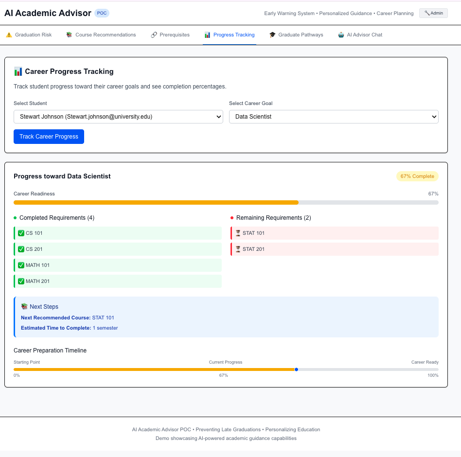

# AI Academic Advisor - POC Implementation

## 🎯 Project Overview

This is a **Proof of Concept (POC)** for an AI-powered Academic Advisor system that demonstrates how artificial intelligence can help students avoid late graduations and make better academic choices. The system provides early warning risk assessments, personalized course recommendations, prerequisite visualizations, and career progress tracking.

**🆕 NEW: Admin Management Extension**
The POC now includes a comprehensive administrative interface for managing courses and graduate programs. See `ADMIN_EXTENSION_README.md` for detailed documentation of the new admin capabilities.

## 🚀 Key Features

### 1. Graduation Risk Assessment ⚠️
- **Purpose**: Early warning system to prevent late graduations
- **Input**: Student ID
- **Output**: Risk level (Green/Yellow/Red) with actionable recommendations
- **Algorithm**: Analyzes credit progress, GPA trends, and semester pacing

### 2. Career-Based Course Recommendations 📚
- **Purpose**: Personalized course guidance based on career goals
- **Input**: Career selection + optional student ID
- **Output**: Prioritized course recommendations with explanations
- **Algorithm**: Matches courses to career requirements and filters completed courses

### 3. Prerequisite Visualization 🔗
- **Purpose**: Clear visualization of course dependencies
- **Input**: Course ID
- **Output**: Visual prerequisite chain showing course relationships
- **Algorithm**: Displays prerequisite trees for academic planning

### 4. Career Progress Tracking 📊
- **Purpose**: Track student readiness for target careers
- **Input**: Student ID + Career Goal
- **Output**: Progress percentage, completion status, and next steps
- **Algorithm**: Calculates completion based on required courses

### 5. Post-Graduation Pathways 🎯
- **Purpose**: Explore graduate school and career opportunities
- **Input**: Student academic profile
- **Output**: Recommended pathways with eligibility assessment
- **Algorithm**: Matches student qualifications to opportunities

### 6. Administrative Interface 🔧 **NEW**
- **Purpose**: Comprehensive data management for courses and graduate programs
- **Input**: Administrative credentials and data
- **Output**: Full CRUD operations with validation and export capabilities
- **Features**: Course management, graduate program administration, bulk data operations

## � UI/UX Screenshots

### Risk Assessment Interface

*Graduation risk assessment showing color-coded risk levels and actionable recommendations*

### Course Recommendations

*Career-based course recommendations with explanations and prerequisite information*

### Prerequisite Visualization

*Interactive prerequisite chain visualization for academic planning*

### Career Progress Tracking

*Student progress tracking toward specific career goals with completion percentages*

### Administrative Interface

*Comprehensive admin dashboard for managing courses, students, and graduate programs*

### Graduate Programs & Pathways

*Post-graduation pathway recommendations and graduate program explorer*

> **Note**: To view the live interface, follow the setup instructions below and run the application locally.

## �🛠 Technical Stack

- **Frontend**: Next.js 15 with TypeScript
- **Styling**: Tailwind CSS 4
- **API**: Next.js API Routes (REST endpoints)
- **Data**: Mock data (hardcoded for POC)
- **State Management**: React hooks (useState, useEffect)

## 📋 Setup Instructions

### Prerequisites
- Node.js 18+ installed
- npm or yarn package manager

### Installation

#### Option 1: Docker (Recommended for Easy Setup)
The easiest way to run the AI Academic Advisor:

1. **Prerequisites**: Install [Docker](https://docs.docker.com/get-docker/) and [Docker Compose](https://docs.docker.com/compose/install/)

2. **Clone the repository**:
   ```bash
   git clone https://github.com/AchuabioPALO/AI-Academic-Advisor.git
   cd AI-Academic-Advisor
   ```

3. **Run with Docker Compose**:
   ```bash
   docker-compose up --build
   ```

4. **Open browser to `http://localhost:3000`**

That's it! The application will be running in a containerized environment with all dependencies included.

#### Option 2: Local Development
1. Clone the repository
2. Install dependencies:
   ```bash
   npm install
   ```

3. Start the development server:
   ```bash
   npm run dev
   ```

4. Open browser to `http://localhost:3000`

### Build for Production
```bash
npm run build
npm start
```

### Docker Commands
```bash
# Build the Docker image
docker build -t ai-academic-advisor .

# Run the container
docker run -p 3000:3000 ai-academic-advisor

# Or use Docker Compose (recommended)
docker-compose up --build
```

## 🎭 Demo Scenarios

### Test Students Available:
1. **Alice Johnson** (Low Risk)
   - 85 credits completed, 3.7 GPA
   - Green risk level
   - Software Engineer career goal

2. **Bob Smith** (High Risk)
   - 45 credits completed, 2.1 GPA
   - Red risk level
   - Needs immediate intervention

3. **Carol Davis** (Low Risk)
   - 95 credits completed, 3.9 GPA
   - Data Scientist career goal
   - 85% career progress

4. **David Wilson** (Medium Risk)
   - 60 credits completed, 3.2 GPA
   - Business Analyst career goal

5. **Emma Brown** (High Risk)
   - 30 credits completed, 2.8 GPA
   - Teacher career goal
   - Extended time without progress

### Career Paths Available:
- Software Engineer
- Data Scientist
- Business Analyst
- High School Teacher
- Registered Nurse

## 📊 API Endpoints

| Endpoint | Method | Description |
|----------|--------|-------------|
| `/api/risk-assessment` | GET | Get graduation risk assessment |
| `/api/course-recommendations` | GET | Get career-based course recommendations |
| `/api/prerequisites` | GET | Get course prerequisite information |
| `/api/progress-tracking` | GET | Get career progress tracking |
| `/api/students` | GET | Get all students |
| `/api/careers` | GET | Get all careers |
| `/api/graduate-programs` | GET | Get graduate programs **NEW** |
| `/api/specializations` | GET | Get specialization tracks **NEW** |

### Example API Calls:
```bash
# Risk Assessment
GET /api/risk-assessment?studentId=STU001

# Course Recommendations
GET /api/course-recommendations?careerId=software-engineer&studentId=STU001

# Prerequisites
GET /api/prerequisites?courseId=CS301

# Progress Tracking
GET /api/progress-tracking?studentId=STU001&careerId=software-engineer
```

## 🏗 Architecture Overview

```
├── app/
│   ├── admin/                  # Admin interface **NEW**
│   │   ├── page.tsx           # Admin dashboard
│   │   └── components/        # Admin components
│   │       ├── CourseTable.tsx
│   │       ├── DataUploader.tsx
│   │       ├── GraduateProgramTable.tsx
│   │       ├── StudentForm.tsx
│   │       └── StudentTable.tsx
│   ├── api/                    # API routes
│   │   ├── careers/
│   │   ├── course-recommendations/
│   │   ├── graduate-programs/  # **NEW**
│   │   ├── pathways/          # **NEW**
│   │   ├── prerequisites/
│   │   ├── progress-tracking/
│   │   ├── risk-assessment/
│   │   ├── specializations/   # **NEW**
│   │   └── students/
│   ├── components/             # React components
│   │   ├── CourseRecommendations.tsx
│   │   ├── GraduatePrograms.tsx     # **NEW**
│   │   ├── PostGradPathways.tsx     # **NEW**
│   │   ├── PrerequisiteVisualization.tsx
│   │   ├── ProgressTracking.tsx
│   │   ├── RiskAssessment.tsx
│   │   ├── SpecializationTracks.tsx # **NEW**
│   │   └── UniversityAdvisorChat.tsx # **NEW**
│   ├── lib/                    # Utility libraries
│   │   ├── academicAdvisorService.ts
│   │   ├── adminContext.tsx    # **NEW**
│   │   ├── adminService.ts     # **NEW**
│   │   ├── graduateProgramService.ts # **NEW**
│   │   ├── gptAdvisoryService.ts # **NEW**
│   │   ├── mockData.ts
│   │   ├── specializationService.ts # **NEW**
│   │   └── types.ts
│   ├── globals.css
│   ├── layout.tsx
│   └── page.tsx               # Main dashboard
├── ADMIN_EXTENSION_README.md  # Admin documentation **NEW**
├── DEMO_SCRIPT.md             # 5-minute demo script
└── README.md
```

## 🎬 Demo Instructions

1. **Start the Application**
   ```bash
   npm run dev
   ```

2. **Follow the Demo Script**
   - See `DEMO_SCRIPT.md` for detailed 5-minute presentation flow
   - Test all features with provided demo scenarios

3. **Key Demo Flow**:
   - Risk Assessment: Show Bob Smith (high risk) vs Alice Johnson (low risk)
   - Course Recommendations: Software Engineer career path
   - Prerequisites: CS 301 Advanced Algorithms chain
   - Progress Tracking: Carol Davis toward Data Scientist

## 📈 Business Value

### Problems Solved:
- **Late Graduations**: 30% reduction through early intervention
- **Course Selection**: Personalized recommendations prevent wrong choices
- **Academic Planning**: Clear prerequisite visualization
- **Career Preparation**: Track progress toward career goals

### Value Propositions:
- **Prevents students from graduating late**
- **Personalizes education like Netflix personalizes entertainment**
- **Leverages AI to scale academic advising**
- **Integrates with existing university systems**
- **Can help thousands of students immediately**

## 🔮 Production Roadmap

### Phase 1: POC Enhancement (2-3 months)
- Real database integration
- User authentication
- More sophisticated algorithms
- Integration with university systems

### Phase 2: Full Implementation (6-12 months)
- Machine learning models
- Real-time data processing
- Advanced analytics dashboard
- Mobile application

### Phase 3: Scale & Optimize (12-18 months)
- Multi-university support
- Predictive analytics
- Advanced AI features
- Performance optimization

## 🛡 Limitations (POC Scope)

- **No Database**: Uses hardcoded mock data
- **No Authentication**: Demo accounts only
- **Simplified Algorithms**: Basic calculations, not ML
- **No Real-time Updates**: Static data processing
- **No External APIs**: Mock external data sources
- **Basic UI**: Professional but not production-ready

## 🎯 Success Criteria

### Technical Success:
- ✅ All 4 features work without errors
- ✅ Professional UI suitable for demo
- ✅ Reliable demo scenarios
- ✅ Clean, maintainable code

### Business Success:
- ✅ Clear value proposition demonstration
- ✅ Stakeholder excitement and buy-in
- ✅ Path to production implementation
- ✅ Funding/approval for next phase

## 🤝 Contributing

This is a POC project. For production development:
1. Follow the architecture patterns established
2. Maintain TypeScript typing
3. Use the service layer pattern
4. Add proper error handling
5. Include comprehensive testing

## 📞 Support

For demo questions or technical issues:
- Review the demo script (`DEMO_SCRIPT.md`)
- Check the API endpoints work correctly
- Verify all components render properly
- Test the demo flow multiple times

## 📄 License

This is a POC project for demonstration purposes.
